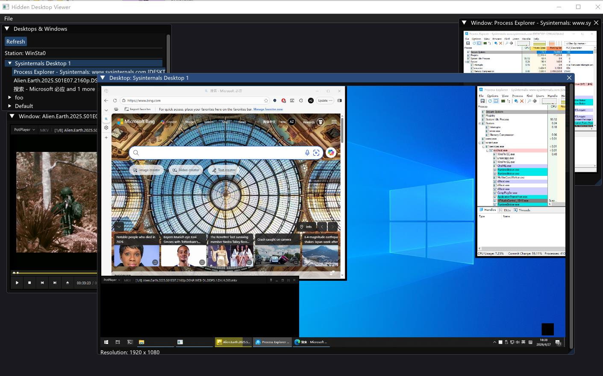

# 隐藏桌面采集

- [隐藏桌面采集](#隐藏桌面采集)
  - [Sysinternals/Desktops](#sysinternalsdesktops)
  - [Virtual-Desktop-A Simple Desktop Management Tool](#virtual-desktop-a-simple-desktop-management-tool)
  - [Hidden Desktop Viewer](#hidden-desktop-viewer)
  - [Hidden VNC](#hidden-vnc)
  - [关于本工程](#关于本工程)

> 隐藏桌面相关使用场景极少。

> 调试基于隐藏桌面的程序时不要频繁切换桌面，会导致不可预期的行为。

## [Sysinternals/Desktops](https://learn.microsoft.com/en-us/sysinternals/downloads/desktops)

Windows 10 之前的桌面管理程序（基于隐藏桌面）。

## Virtual-Desktop-A Simple Desktop Management Tool

由于作者 Malinath Karkanti 在 CodeProject 的[原文](https://www.codeproject.com/articles/Virtual-Desktop-A-Simple-Desktop-Management-Tool)已经无法访问，故备份到个人仓库。

## [Hidden Desktop Viewer](https://github.com/AgigoNoTana/HiddenDesktopViewer)

这是一个监控所有桌面对象及其进程的程序。

## Hidden VNC

[初学者入门：Hidden VNC](https://www.malwaretech.com/2015/09/hidden-vnc-for-beginners.html)

[隐藏（不可见）桌面潜藏的威胁及其运作机制](https://www.mbsd.jp/research/20180914/tyrant-hiddenvnc/)

[从HeaderLessPE到扩展实现HideVNC下Gui攻击技术](https://cn-sec.com/archives/2046540.html)

[ntdll0/HVNC](https://github.com/ntdll0/HVNC)

## 关于本工程

**本工程是一个简单的采集隐藏桌面（包含 Default）和隐藏桌面窗口的示例程序。**

使用方法很简单，**双击即可对所选桌面或窗口进行采集**。

